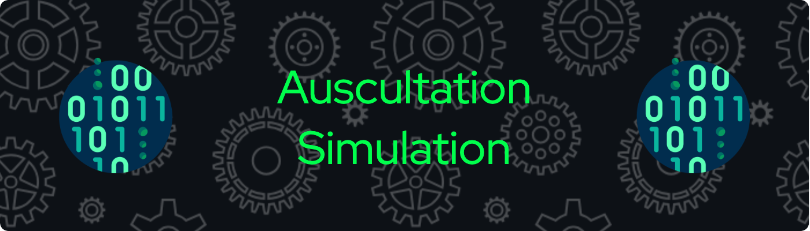

## Introduction
<p>
The Auscultation Simulator is a project designed to provide a realistic and immersive simulation environment for medical training and education. This innovative system aims to replicate authentic auscultation scenarios, allowing healthcare professionals, students, and educators to practice and refine their skills in a controlled and risk-free environment.

Auscultation, the art of listening to internal sounds of the body using a stethoscope, is a fundamental skill for medical practitioners. The Auscultation Simulator addresses the need for a comprehensive training tool by combining advanced technology with hands-on experience. This documentation serves as your guide through the setup, configuration, and usage of the Auscultation Simulator, ensuring a seamless integration of the Django web framework for the server-side and Raspberry Pi 4 Model B for handling sound playback and real-time simulation.

Whether you are a seasoned healthcare professional looking to refine your auscultation techniques or a student eager to master this vital skill, this simulator offers a dynamic and authentic learning experience.
</p>

## Aim
<p>
The primary aim of the Auscultation Simulator is to provide a sophisticated and realistic platform for medical professionals, students, and educators to enhance their auscultation skills. This innovative project addresses the critical need for a comprehensive training tool that goes beyond traditional methods, offering a controlled and risk-free environment for individuals to practice and refine their abilities in the art of listening to internal body sounds.
</p>

## Objective
- Replicate genuine auscultation scenarios to provide users with a realistic and immersive training environment.
- Integrate accurate sound patterns and variations to closely mimic diverse patient conditions for enhanced authenticity.
- Facilitate skill development by offering scenarios tailored to different proficiency levels, allowing users to progress from basic to advanced auscultation techniques.
- Implement a system that provides constructive feedback to users, enabling them to identify and address specific areas for improvement.
- Design an intuitive interface for easy navigation and interaction, ensuring accessibility for users with varying technical backgrounds.
- Make the Auscultation Simulator available across different devices and platforms to maximize accessibility for healthcare professionals, students, and educators.


## Project Scope
<p>
The project scope of the Auscultation Simulator encompasses the design and development of a sophisticated training and educational platform for auscultation skills in the medical field. This simulator aims to create a realistic and immersive environment, utilizing advanced sound patterns and variability to replicate authentic auscultation scenarios. The scope extends to providing users with a progressive learning experience, accommodating different skill levels and fostering continuous skill development. Seamless integration of the Django web framework for efficient server-side operations and the utilization of the Raspberry Pi 4 Model B for handling sound playback and real-time simulation are integral components of the project. The simulator's accessibility across various devices and platforms ensures its availability to a wide audience, including healthcare professionals, students, and educators, contributing to the advancement of auscultation proficiency in a controlled and risk-free setting.
</p>

## Technology Used:
- #### Languages:
  - 
  - 
  - 
  - 
  - 
- #### Framework:
  - 
  - 
  - 
- #### Hardware:
  - Raspberry Pi 4 (Model B) - 8 GB RAM
  - 16x2 LCD Display
  - Buzzer
  - Jumper Wire
  - Breadboard
  - Bootable USB SSD
  - USB 3.0 7-Port Hub
  - Soundcard adapter
- #### Database:
  - 
- #### IDE:
  - 
  - 
  - 
- #### OS Used for Testing:
  - 
  - 
  - 
  - 
  - 
- #### Tools for Designing:
  - 
  - 
- #### Version Control:
  - 

## Prerequisites:
```bash
  Adafruit-CharLCD==1.1.1
  Adafruit-GPIO==1.0.3
  Adafruit-PureIO==1.1.11
  ansi2html==1.9.1
  appnope==0.1.3
  asgiref==3.7.2
  asttokens==2.4.1
  attrs==23.2.0
  beautifulsoup4==4.12.3
  blinker==1.7.0
  cachelib==0.9.0
  cachetools==5.3.2
  certifi==2023.11.17
  cffi==1.16.0
  channels==4.0.0
  charset-normalizer==3.3.2
  click==8.1.7
  colorzero==2.0
  comm==0.2.1
  contourpy==1.2.0
  cycler==0.12.1
  dash==2.9.3
  dash-bootstrap-components==1.5.0
  dash-core-components==2.0.0
  dash-html-components==2.0.0
  dash-table==5.0.0
  dataclass-wizard==0.22.3
  debugpy==1.8.0
  decorator==5.1.1
  Django==4.2.9
  django-crispy-forms==2.1
  django-plotly-dash==2.2.2
  dpd-components==0.1.0
  EditorConfig==0.12.4
  executing==2.0.1
  Flask==3.0.0
  Flask-Caching==2.1.0
  fonttools==4.47.0
  gpiozero==2.0.1
  h11==0.14.0
  idna==3.6
  importlib-metadata==7.0.1
  ipykernel==6.29.0
  ipython==8.20.0
  itsdangerous==2.1.2
  jedi==0.19.1
  Jinja2==3.1.2
  joblib==1.3.2
  jsbeautifier==1.15.0
  jupyter_client==8.6.0
  jupyter_core==5.7.1
  kiwisolver==1.4.5
  MarkupSafe==2.1.3
  matplotlib==3.8.2
  matplotlib-inline==0.1.6
  more-itertools==9.1.0
  nest-asyncio==1.6.0
  neurokit2==0.2.7
  numpy==1.26.3
  outcome==1.3.0.post0
  packaging==23.2
  pandas==2.1.4
  parso==0.8.3
  pexpect==4.9.0
  pillow==10.2.0
  platformdirs==4.1.0
  playsound==1.3.0
  plotly==5.18.0
  prompt-toolkit==3.0.43
  psutil==5.9.8
  ptyprocess==0.7.0
  pure-eval==0.2.2
  PyAudio==0.2.14
  pycparser==2.21
  pydub==0.25.1
  pygame==2.5.2
  Pygments==2.17.2
  pyo==1.0.5
  pyorbital==1.8.2
  pyparsing==3.1.1
  PySocks==1.7.1
  python-dateutil==2.8.2
  pytz==2023.3.post1
  pyzmq==25.1.2
  requests==2.31.0
  retrying==1.3.4
  scikit-learn==1.3.2
  scipy==1.11.4
  selenium==4.17.2
  six==1.16.0
  sniffio==1.3.0
  sortedcontainers==2.4.0
  SoundCard==0.4.2
  sounddevice==0.4.6
  soundfile==0.12.1
  soupsieve==2.5
  sqlparse==0.4.4
  stack-data==0.6.3
  tenacity==8.2.3
  threadpoolctl==3.2.0
  tornado==6.4
  traitlets==5.14.1
  trio==0.24.0
  trio-websocket==0.11.1
  typing_extensions==4.9.0
  tzdata==2023.4
  urllib3==2.1.0
  wcwidth==0.2.13
  Werkzeug==3.0.1
  wsproto==1.2.0
  zipp==3.17.0
```

## Project Installation:
**STEP 1:** Clone the repository from GitHub.
```bash

```

**STEP 2:** Change the directory to the repository.
```bash
```

**STEP 3:** Create a virtual environment
(For Windows)
```bash
  python -m venv virtualenv
```
(For MacOS and Linux)
```bash
  python3 -m venv virtualenv
```

**STEP 4:** Activate the virtual environment.
(For Windows)
```bash
  virtualenv\Scripts\activate
```
(For MacOS and Linux)
```bash
  source virtualenv/bin/activate
```

**STEP 5:** Install the dependencies.
```bash
  python -m pip install -r requirements.txt
```

**STEP 6:** Migrate the Django project.
(For Windows)
```bash
  python manage.py migrate
```
(For MacOS and Linux)
```bash
  python3 manage.py migrate
```

**STEP 7:** Run the application.
(For Windows)
```bash
  python manage.py runserver
```
(For MacOS and Linux)
```bash
  python3 manage.py runserver
```

## Output Screen-shots:


